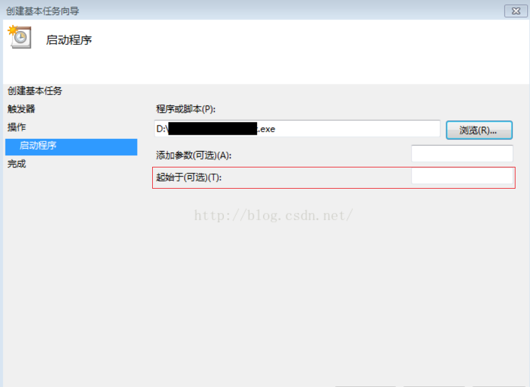

## NUIST健康日报自动填写工具

> 本项目主要用于NUIST学生健康日报的自动填写，名字`HDRFA`是`Health Daily Report Fill Auto`的首字母缩写，本项目仅支持`Chrome`与新版`Edge`浏览器（也就是使用`chromium`内核的，关于如何区别是旧内核还是新内核，可以看[这里](https://jingyan.baidu.com/article/2fb0ba4071cb7c41f3ec5f19.html)。

### 使用方法：

使用方法有两种，一种是下载源代码，自己运行项目，另一种是下载已经用`PyInstaller`[编译好的文件](https://github.com/Yaser-wyx/HDRFA_NUIST/releases/tag/v0.1)，如果没有VPN可能下载比较慢，我已经放到百度云盘里面了：

```
链接：https://pan.baidu.com/s/1-tlXN84Yu4KBPR7DdUVCaA 
提取码：iktu 
```

如果是下载源码运行，那么需要确保已经安装python3，并且安装了selenium、msedge-selenium-tools以及psutil这些模块，没有安装的，使用以下命令安装：

``` shell
pip install msedge-selenium-tools
pip install selenium
pip install psutil
```

### 使用步骤：

1. 下载要使用的浏览器驱动，即WebDriver

   - chrome浏览器在这里[下载](https://chromedriver.chromium.org/downloads)
   - edge浏览器在这里[下载](https://developer.microsoft.com/en-us/microsoft-edge/tools/webdriver/)

   **注意：一定要下载自己浏览器对应版本号的驱动，否则可能无法运行。**

   - [chrome浏览器版本号查看方法](https://jingyan.baidu.com/article/bad08e1ed2d0d709c9512155.html#:~:text=%E6%96%B9%E6%B3%95%2F%E6%AD%A5%E9%AA%A41&text=%E5%9C%A8%E6%89%93%E5%BC%80%E7%9A%84Chrome%E6%B5%8F%E8%A7%88,%E8%A7%92%E7%9A%84%E2%80%9C%E8%8F%9C%E5%8D%95%E2%80%9D%E6%8C%89%E9%92%AE%E3%80%82&text=%E5%9C%A8%E6%89%93%E5%BC%80%E7%9A%84%E4%B8%8B%E6%8B%89%E8%8F%9C%E5%8D%95,%E6%B5%8F%E8%A7%88%E5%99%A8%E7%9A%84%E7%89%88%E6%9C%AC%E5%8F%B7%E3%80%82)
   - [edge浏览器版本号查看方法](https://jingyan.baidu.com/article/11c17a2c51444cb546e39d8f.html)

2. 打开压缩包或源码中的`config.json`填写相关配置

   - `userList`就是要填写日报的用户列表，支持多人自动填写日报，将自己的学号和密码填到指定位置即可
   - `browserType`就是使用的浏览器类型
     - 值为`0`就是使用`Edge`浏览器，否则就是使用`Chrome`浏览器
   - `webDriverLocation`就是下载的浏览器驱动地址，相对路径或绝对路径都可以（**建议还是使用绝对路径**），并且路径填写的时候将所有的`\`换成`\\`或`/`，否则会出现路径问题。
   - `showBrowser`就是填写报表的时候，是否会显示浏览器，如果为`false`就是后台运行不显示，`true`就是在前台显示，默认是`false`

3. 运行`main.exe`（源码就运行`main.py`）就可以运行了。

4. 如果要每天开机自动运行，可以参照该[教程](https://blog.csdn.net/lordwish/article/details/51742585)，将要自动运行的程序设为`task.exe`，其中有一项需要改动：

   - 将`起始于`（下图中框起来的部分）填写为task.exe解压后的根目录，例如：`F:\dist\`
   - 

---
## 更新和BUG修复日志：
- 2021/2/17：
  1. 对于task增加了检测上一次运行是否成功，成功则不运行，否则再次运行。
   2. 修复了若干BUG
  

